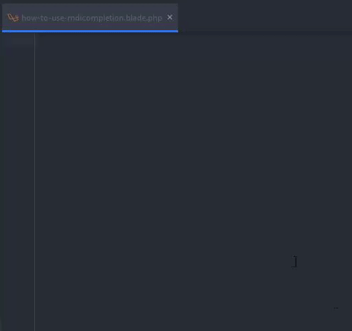

<a href="https://thedevjulian.com" target="_blank">
  
</a>

---

# MdiCompletion

**_The source code of this plugin is based on other repository's that I found on the internet!_** 

I created this for myself to find the icons faster while developing.


A plugin for Auto Completion for Material Design Icons (Version: 5.0.45) while typing.
Just start typing ":mdi" and the list with all the mdi icons will show. This plugin has only been tested on PhpStorm.
While you're hit `Tab` it will replace the select item with:
```html 
<i class="mdi mdi-account"></i>
```

<br>



# Sponsor me
By sponsoring me, you will show that you love my work. Also, I wil get more motivated to work on open projects and maintain them.

PayPal: https://paypal.me/TheDevJulian
